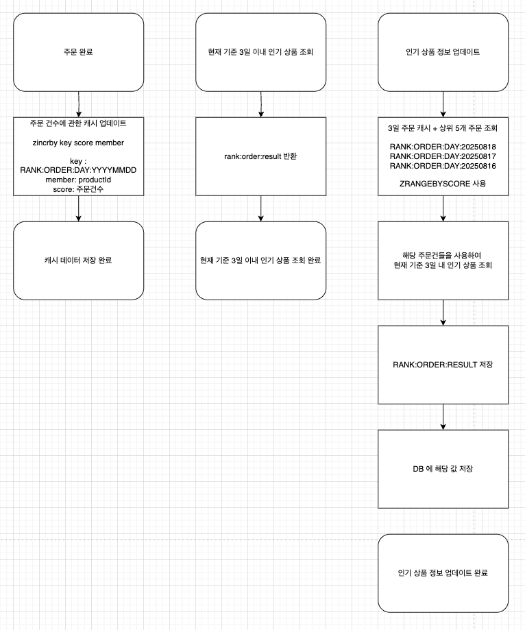

# 캐시 적용 보고서

## 개요

서비스에서 조회 기능 중 많이 조회하거나 조회 속도가 느린 기능에 대해서 캐시를 적용합니다. 이를 통해 DB 부하를 줄이고, 사용자의 서비스 사용 경험을 향상시킵니다.

## 대상 로직
캐시 적용 대상 로직은 다음과 같습니다.
1. 인기 상품 조회
- 선정 이유 : 다수의 사람들이 조회하는 기능입니다. 해당 데이터는 자주 변경되고 DB 에 부하가 많이 가는 로직이므로, 일정 주기를 가지고 새로고침하는 캐싱에 적합합니다.
2. 상품 상세 조회
- 선정 이유 : 다수의 사람들이 상품 정보를 얻고자 할때 보는 화면입니다. 상품 정보는 자주 변경되지 않아 hit rate 가 높아 적합합니다.

## 캐싱 사용
- Spring Cache
  - 애노테이션을 사용하여 비즈니스 로직과 캐싱을 분리하여 유지보수성을 높이고, 선언적 캐싱을 사용합니다.
- Redis
  - 분산 캐시를 사용하여 여러 서버에서 동일한 캐시 데이터를 공유할 수 있도록 합니다. Redis는 빠른 속도와 높은 가용성을 제공하여 캐시 저장소로 적합합니다.
    
## 구현
1. 인기 상품 조회 캐시

2. 상품 상세 조회 캐시
   - `@Cacheable` 애노테이션을 사용하여 상품 상세 조회 메서드에 캐시를 적용합니다.
   - 해당 캐시는 1시간의 TTL 을 가집니다. 상품의 정보가 변경되었을 경우 (주문으로 인한 재고 수정) 캐시를 무효화합니다.

## 개선결과
- 인기 상품 조회 (orderProduct 의 총 데이터는 10만개입니다.)

- 상품 조회 (PK 로 조회하는 상품 조회입니다. 총 데이터는 10만개입니다.)

## 결론
캐시 적용을 통해 조회 속도가 개선된 것을 확인하였습니다.
