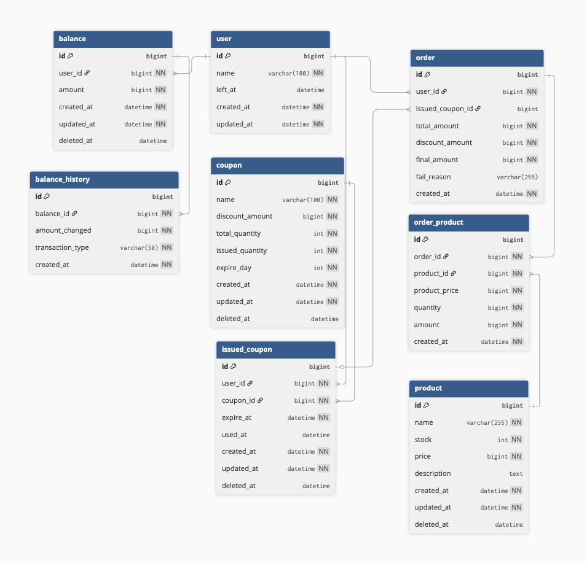

<!-- 삭제 정책 통일 필요
상위 상품 조회 시 주문기록을 통해서 조회 (데이터 플랫폼이 아니라) -->

## ERD



## DDL

```sql
CREATE TABLE product (
                         id BIGINT AUTO_INCREMENT PRIMARY KEY,
                         name VARCHAR(255) NOT NULL COMMENT '상품 이름',
                         stock INT NOT NULL COMMENT '재고',
                         price INT NOT NULL COMMENT '상품 가격',
                         description TEXT COMMENT '상품 상세설명',
                         created_at DATETIME NOT NULL,
                         updated_at DATETIME NOT NULL
);

CREATE TABLE balance (
                         id BIGINT AUTO_INCREMENT PRIMARY KEY,
                         user_id BIGINT NOT NULL,
                         amount INT NOT NULL COMMENT '잔고',
                         created_at DATETIME NOT NULL,
                         updated_at DATETIME NOT NULL,
                         deleted_at DATETIME,
                         version BIGINT NOT NULL DEFAULT 0
);

CREATE TABLE balance_history (
                                 id BIGINT AUTO_INCREMENT PRIMARY KEY,
                                 balance_id BIGINT NOT NULL,
                                 changed_amount INT NOT NULL,
                                 transaction_type VARCHAR(50) NOT NULL COMMENT 'CHARGE, USE',
                                 created_at DATETIME NOT NULL
);

CREATE TABLE coupon (
                        id BIGINT AUTO_INCREMENT PRIMARY KEY,
                        name VARCHAR(100) NOT NULL,
                        discount_amount INT NOT NULL COMMENT '할인할 가격',
                        total_quantity INT NOT NULL COMMENT '전체 쿠폰의 수',
                        issued_quantity INT NOT NULL COMMENT '발행된 쿠폰의 수',
                        expire_day INT NOT NULL COMMENT 'N일 후 만료',
                        created_at DATETIME NOT NULL,
                        updated_at DATETIME NOT NULL,
                        deleted_at DATETIME
);

CREATE TABLE issued_coupon (
                               id BIGINT AUTO_INCREMENT PRIMARY KEY,
                               user_id BIGINT NOT NULL,
                               coupon_id BIGINT NOT NULL,
                               expire_at DATETIME NOT NULL,
                               used_at DATETIME,
                               created_at DATETIME NOT NULL,
                               updated_at DATETIME NOT NULL,
                               deleted_at DATETIME
);

CREATE TABLE `order` (
                         id BIGINT AUTO_INCREMENT PRIMARY KEY,
                         user_id BIGINT NOT NULL,
                         fail_reason VARCHAR(255) COMMENT '실패 사유',
                         created_at DATETIME NOT NULL
);

CREATE TABLE order_product (
                               id BIGINT AUTO_INCREMENT PRIMARY KEY,
                               product_id BIGINT NOT NULL,
                               order_id BIGINT NOT NULL,
                               quantity INT NOT NULL COMMENT '구매 수량',
                               created_at DATETIME NOT NULL
);

CREATE TABLE order_payment (
                               id BIGINT AUTO_INCREMENT PRIMARY KEY,
                               user_id BIGINT NOT NULL,
                               order_amount INT NOT NULL COMMENT '결제 금액',
                               discount_amount INT NOT NULL COMMENT '할인 금액',
                               used_amount INT NOT NULL COMMENT '사용한 금액',
                               created_at DATETIME NOT NULL
);
```