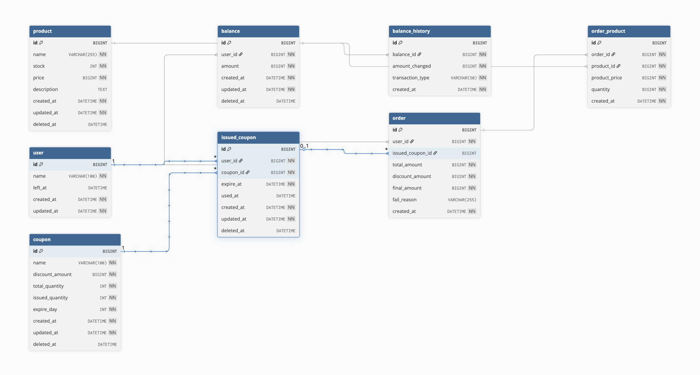

<!-- 삭제 정책 통일 필요
상위 상품 조회 시 주문기록을 통해서 조회 (데이터 플랫폼이 아니라) -->

## ERD



## DDL

```sql
CREATE TABLE user (
    id BIGINT AUTO_INCREMENT PRIMARY KEY,
    name VARCHAR(100) NOT NULL,
    left_at DATETIME,
    created_at DATETIME NOT NULL,
    updated_at DATETIME NOT NULL
);

CREATE TABLE product (
    id BIGINT AUTO_INCREMENT PRIMARY KEY,
    name VARCHAR(255) NOT NULL COMMENT '상품 이름',
    stock INT NOT NULL COMMENT '재고',
    price BIGINT NOT NULL COMMENT '상품 가격',
    description TEXT COMMENT '상품 상세설명',
    created_at DATETIME NOT NULL,
    updated_at DATETIME NOT NULL,
    deleted_at DATETIME
);

CREATE TABLE balance (
    id BIGINT AUTO_INCREMENT PRIMARY KEY,
    amount BIGINT NOT NULL COMMENT '잔고',
    created_at DATETIME NOT NULL,
    updated_at DATETIME NOT NULL,
    deleted_at DATETIME
);

CREATE TABLE balance_history (
    id BIGINT AUTO_INCREMENT PRIMARY KEY,
    user_id BIGINT NOT NULL,
    balance_id BIGINT NOT NULL,
    amount_changed BIGINT NOT NULL,
    transaction_type VARCHAR(50) NOT NULL COMMENT 'CHARGE, USE',
    created_at DATETIME NOT NULL,
    FOREIGN KEY (user_id) REFERENCES user(id),
    FOREIGN KEY (balance_id) REFERENCES balance(id)
);

CREATE TABLE coupon (
    id BIGINT AUTO_INCREMENT PRIMARY KEY,
    name VARCHAR(100) NOT NULL,
    discount_amount BIGINT NOT NULL COMMENT '할인할 가격',
    total_quantity INT NOT NULL COMMENT '전체 쿠폰의 수',
    issued_quantity INT NOT NULL COMMENT '발행된 쿠폰의 수',
    expire_day INT NOT NULL COMMENT 'N일 후 만료',
    created_at DATETIME NOT NULL,
    updated_at DATETIME NOT NULL,
    deleted_at DATETIME
);

CREATE TABLE issued_coupon (
    id BIGINT AUTO_INCREMENT PRIMARY KEY,
    user_id BIGINT NOT NULL,
    coupon_id BIGINT NOT NULL,
    expire_at DATETIME NOT NULL,
    used_at DATETIME,
    created_at DATETIME NOT NULL,
    updated_at DATETIME NOT NULL,
    deleted_at DATETIME,
    FOREIGN KEY (user_id) REFERENCES user(id),
    FOREIGN KEY (coupon_id) REFERENCES coupon(id)
);

CREATE TABLE order_history (
    id BIGINT AUTO_INCREMENT PRIMARY KEY,
    user_id BIGINT NOT NULL,
    issued_coupon_id BIGINT,
    total_amount BIGINT NOT NULL COMMENT '할인 전 원래 가격',
    discount_amount BIGINT NOT NULL COMMENT '쿠폰의 할인 가격',
    final_amount BIGINT NOT NULL COMMENT '최종 결제 금액',
    fail_reason VARCHAR(255) COMMENT '실패 사유',
    created_at DATETIME NOT NULL,
    FOREIGN KEY (user_id) REFERENCES user(id),
    FOREIGN KEY (issued_coupon_id) REFERENCES issued_coupon(id)
);

CREATE TABLE order_history_product (
    id BIGINT AUTO_INCREMENT PRIMARY KEY,
    order_history_id BIGINT NOT NULL,
    product_id BIGINT NOT NULL,
    product_price BIGINT NOT NULL COMMENT '상품 주문 당시 가격',
    quantity BIGINT NOT NULL COMMENT '구매 수량',
    amount BIGINT NOT NULL COMMENT '총액 (가격 * 수량)',
    created_at DATETIME NOT NULL,
    FOREIGN KEY (order_history_id) REFERENCES order_history(id),
    FOREIGN KEY (product_id) REFERENCES product(id)
);
```