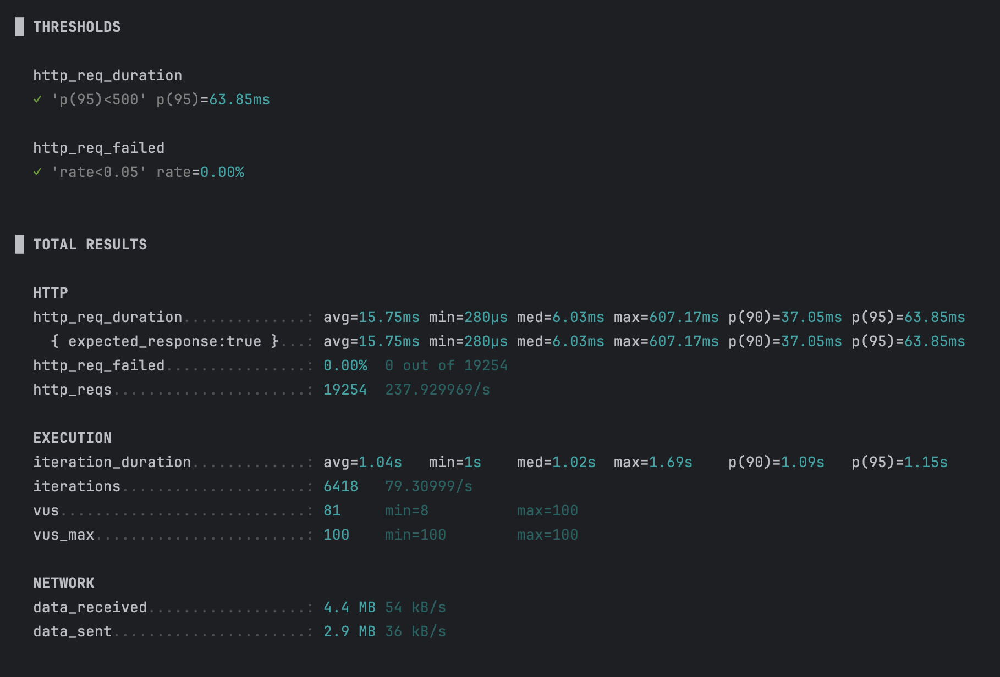
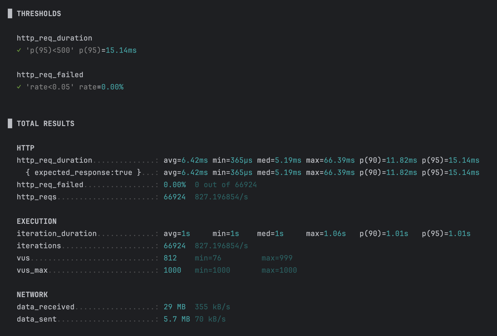
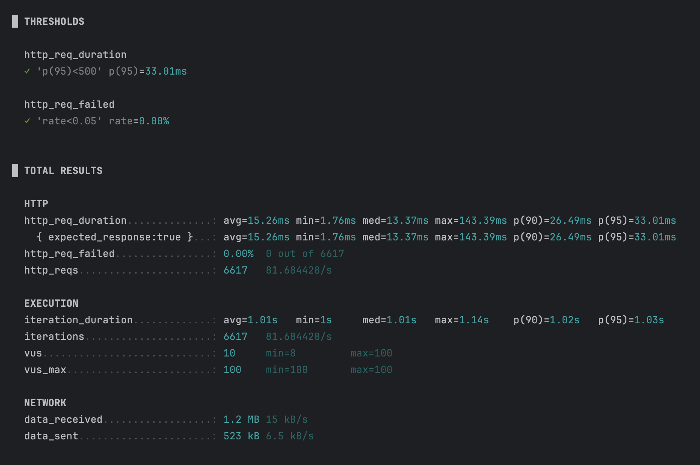

# 부하 테스트 보고서

## 개요 

커머스 서비스에서 발생할 수 있는 부하를 테스트해보고, 서비스가 안정적으로 운영될 수 있는지 확인합니다.

## 테스트 환경
- M1 MacBook Pro
- 16GB RAM
- k6 사용

## 테스트 시나리오
- 공통 
  - 처음 10초간 80명의 사용자가 결제 요청, 이후 1분간 100명의 사용자가 결제 요청, 이후 10초간 80명의 사용자가 결제 요청
  - 한명의 유저에 대한 시나리오가 종료된 이후 1초간 대기
- 결제 (같은 사용자가 동시에 결제 요청을 보내지 않는다는 가정 하에 테스트 진행)
  1. 인기 상품 조회
  2. 상품 상세 조회
  3. 결제 요청
- 인기 상품 조회
  1. 인기 상품 조회
- 상품 상세 조회
  1. 상품 상세 조회

## 테스트 목표
- p95 응답 시간 500ms 이하
- 에러율 5% 이하

## 테스트 결과 및 결론
1. 결제 요청

- p95 응답 시간: 63.85ms
- 에러율: 0.00%
- 여러 도메인을 거쳐 데이터를 처리하는 API 라 max 응답 속도가 607ms 로 나왔음. 사용자가 더 늘어날 경우에는 응답 속도를 개선해야 할 것 같음.

2. 인기 상품 조회 요청

- p95 응답 시간: 15.41ms
- 에러율: 0.00%
- 캐시를 미리 만들어 두기 때문에 max 응답 속도가 66ms 로 나왔음. 다만 실시간 업데이트는 아니기 때문에 유저에게 보여지는 정보는 정답에 근사한 값이다.
- 실시간에 가깝게 정보를 제공하는 방법을 고민해보면 좋을 듯 하다.

3. 상품 상세 조회 요청

- p95 응답 시간: 15.41ms
- 에러율: 0.00%
- p95 는 만족할 만한 성능이 나왔으나, 캐시가 없을 경우에는 DB 를 조회하여 캐시를 제작하기 떄문에 max 응답 속도가 140ms 가 나왔음.
- 당장은 문제가 없겠으나, 트래픽이 더 늘어날 경우에는 캐시 데이터를 미리 생성해두는 것이 좋을 것 같음.
