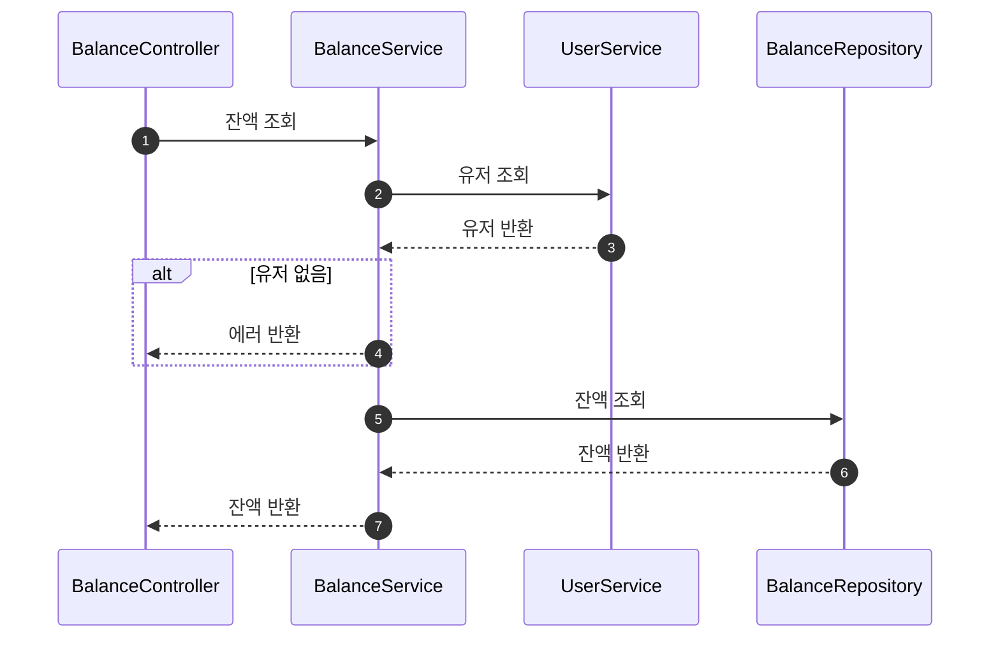
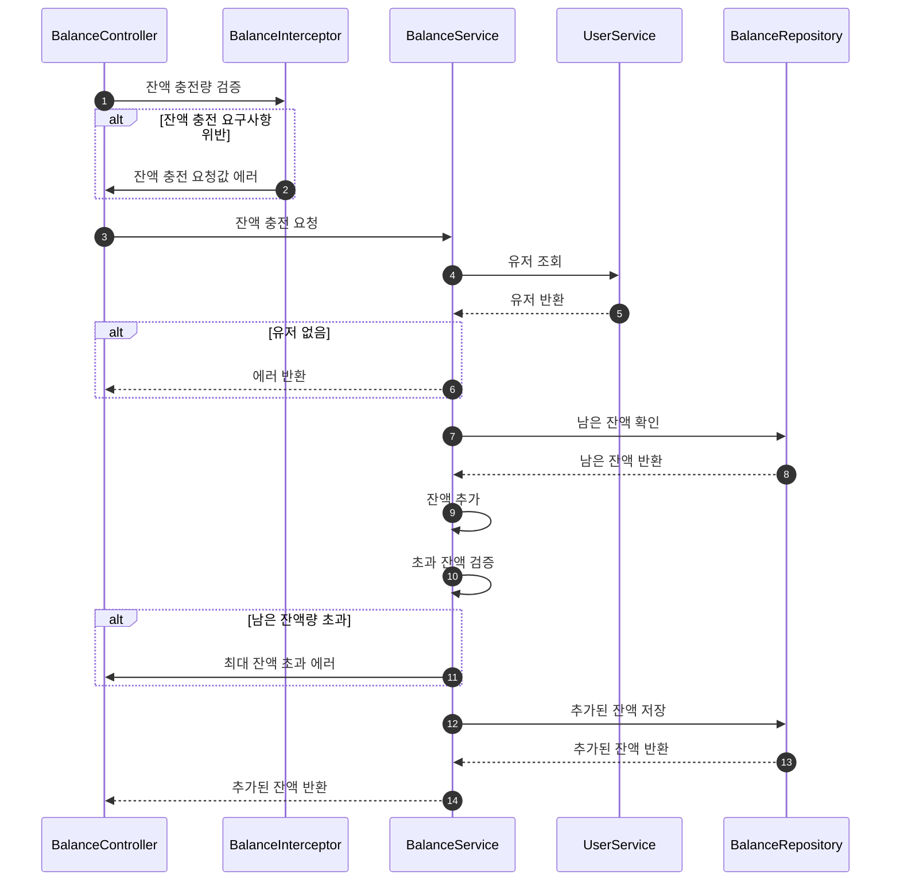
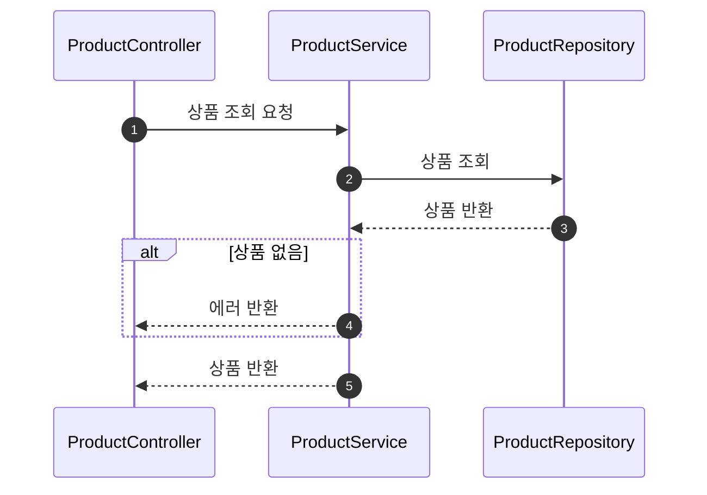
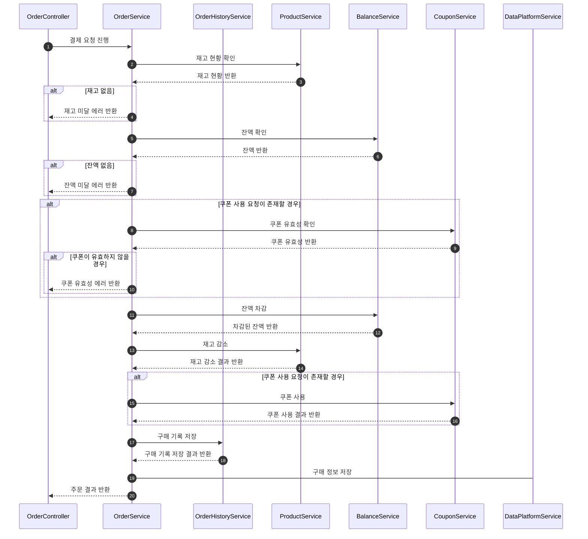
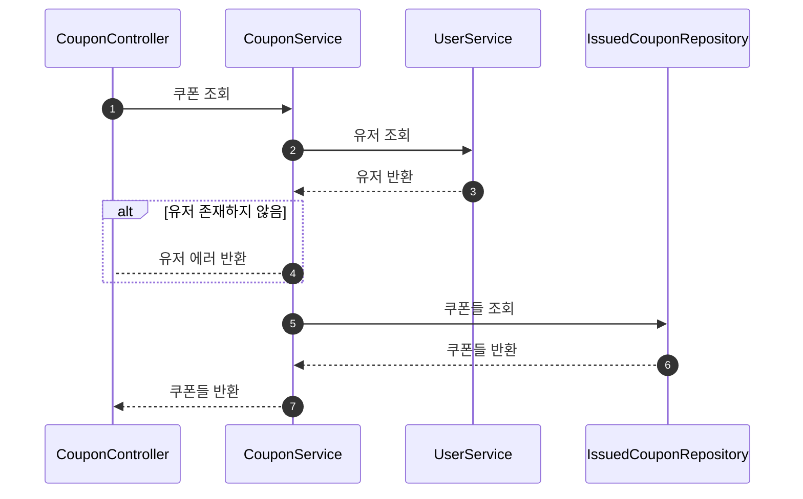
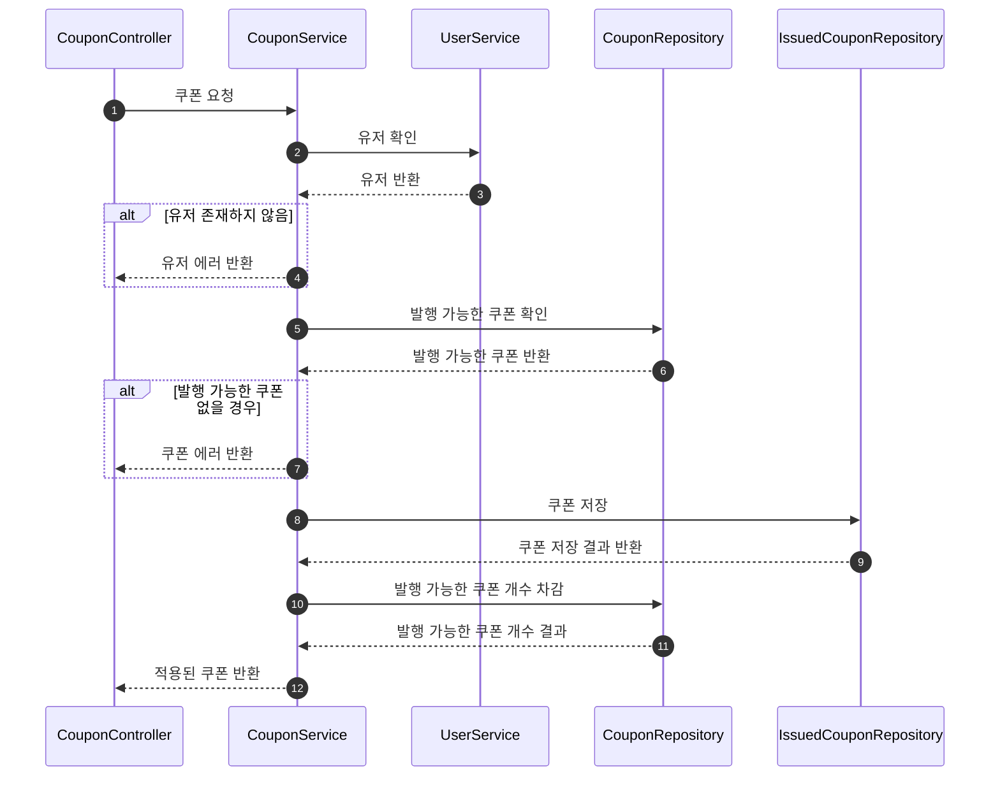
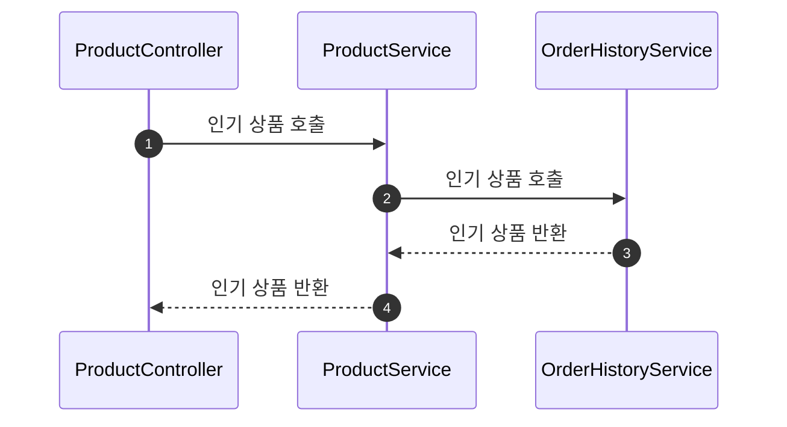

### 잔액 조회

```mermaid
sequenceDiagram
    autonumber
    participant BalanceController
    participant BalanceService
    participant UserService
    participant BalanceRepository

    BalanceController->>BalanceService: 잔액 조회
    BalanceService->>UserService: 유저 조회
    UserService-->>BalanceService: 유저 반환
    alt 유저 없음
        BalanceService-->>BalanceController: 에러 반환
    end
    BalanceService->>BalanceRepository: 잔액 조회
    BalanceRepository-->>BalanceService: 잔액 반환
    BalanceService-->>BalanceController: 잔액 반환
```

### 잔액 충전

```mermaid
sequenceDiagram
    autonumber
    participant BalanceController
    participant BalanceInterceptor
    participant BalanceService
    participant UserService
    participant BalanceRepository

    BalanceController->>BalanceInterceptor: 잔액 충전량 검증
    alt 잔액 충전 요구사항 위반
        BalanceInterceptor->>BalanceController: 잔액 충전 요청값 에러
    end
    BalanceController->>BalanceService: 잔액 충전 요청
    BalanceService->>UserService: 유저 조회
    UserService-->>BalanceService: 유저 반환
    alt 유저 없음
        BalanceService-->>BalanceController: 에러 반환
    end
    BalanceService->>BalanceRepository: 남은 잔액 확인
    BalanceRepository-->>BalanceService: 남은 잔액 반환
    BalanceService->>BalanceService: 잔액 추가
    BalanceService->>BalanceService: 초과 잔액 검증
    alt 남은 잔액량 초과
        BalanceService->>BalanceController: 최대 잔액 초과 에러
    end
    BalanceService->>BalanceRepository: 추가된 잔액 저장
    BalanceRepository-->>BalanceService: 추가된 잔액 반환
    BalanceService-->>BalanceController: 추가된 잔액 반환
```

### 상품 조회

```mermaid
sequenceDiagram
    autonumber
    participant ProductController
    participant ProductService
    participant ProductRepository

    ProductController->>ProductService: 상품 조회 요청
    ProductService->>ProductRepository: 상품 조회
    ProductRepository-->>ProductService: 상품 반환
    alt 상품 없음
        ProductService-->>ProductController: 에러 반환
    end
    ProductService-->>ProductController: 상품 반환
```

### 주문/결제

```mermaid
sequenceDiagram
    autonumber
    participant OrderController
    participant OrderService
    participant OrderHistoryService
    participant ProductService
    participant BalanceService
    participant CouponService
    participant OrderService
    participant DataPlatformService

    OrderController->>OrderService: 결제 요청 진행
    OrderService->>ProductService: 재고 현황 확인
    ProductService-->>OrderService: 재고 현황 반환
    alt 재고 없음
        OrderService-->>OrderController: 재고 미달 에러 반환
    end
    OrderService->>BalanceService: 잔액 확인
    BalanceService-->>OrderService: 잔액 반환
    alt 잔액 없음
        OrderService-->>OrderController: 잔액 미달 에러 반환
    end
    alt 쿠폰 사용 요청이 존재할 경우
        OrderService->>CouponService: 쿠폰 유효성 확인
        CouponService-->>OrderService: 쿠폰 유효성 반환
        alt 쿠폰이 유효하지 않을 경우
            OrderService-->>OrderController: 쿠폰 유효성 에러 반환
        end
    end
    OrderService->>BalanceService: 잔액 차감
    BalanceService-->>OrderService: 차감된 잔액 반환
    OrderService->>ProductService: 재고 감소
    ProductService-->>OrderService: 재고 감소 결과 반환
    alt 쿠폰 사용 요청이 존재할 경우
        OrderService->>CouponService: 쿠폰 사용
        CouponService-->>OrderService: 쿠폰 사용 결과 반환
    end
    OrderService->>OrderHistoryService: 구매 기록 저장
    OrderHistoryService-->>OrderService: 구매 기록 저장 결과 반환
    OrderService->DataPlatformService: 구매 정보 저장
    OrderService-->>OrderController: 주문 결과 반환
```

### 쿠폰 조회

```mermaid
sequenceDiagram
    autonumber
    participant CouponController
    participant CouponService
    participant UserService
    participant IssuedCouponRepository

    CouponController->>CouponService: 쿠폰 조회
    CouponService->>UserService: 유저 조회
    UserService-->>CouponService: 유저 반환
    alt 유저 존재하지 않음
        CouponService-->CouponController: 유저 에러 반환
    end
    CouponService->>IssuedCouponRepository: 쿠폰들 조회
    IssuedCouponRepository-->>CouponService: 쿠폰들 반환
    CouponService-->>CouponController: 쿠폰들 반환
```

### 선착순 쿠폰 발급

```mermaid
sequenceDiagram
    autonumber
    participant CouponController
    participant CouponService
    participant UserService
    participant CouponRepository
    participant IssuedCouponRepository

    CouponController->>CouponService: 쿠폰 요청
    CouponService->>UserService: 유저 확인
    UserService-->>CouponService: 유저 반환
    alt 유저 존재하지 않음
        CouponService-->>CouponController: 유저 에러 반환
    end
    CouponService->>CouponRepository: 발행 가능한 쿠폰 확인
    CouponRepository-->>CouponService: 발행 가능한 쿠폰 반환
    alt 발행 가능한 쿠폰 없을 경우
        CouponService-->>CouponController: 쿠폰 에러 반환
    end
    CouponService->>IssuedCouponRepository: 쿠폰 저장
    IssuedCouponRepository-->>CouponService: 쿠폰 저장 결과 반환
    CouponService->>CouponRepository: 발행 가능한 쿠폰 개수 차감
    CouponRepository-->>CouponService: 발행 가능한 쿠폰 개수 결과
    CouponService-->>CouponController: 적용된 쿠폰 반환
```

### 인기 판매 상품 조회

```mermaid
sequenceDiagram
    autonumber
    participant ProductController
    participant ProductService
    participant OrderHistoryService

    ProductController->>ProductService: 인기 상품 호출
    ProductService->>OrderHistoryService: 인기 상품 호출
    OrderHistoryService-->>ProductService: 인기 상품 반환
    ProductService-->>ProductController: 인기 상품 반환
```
