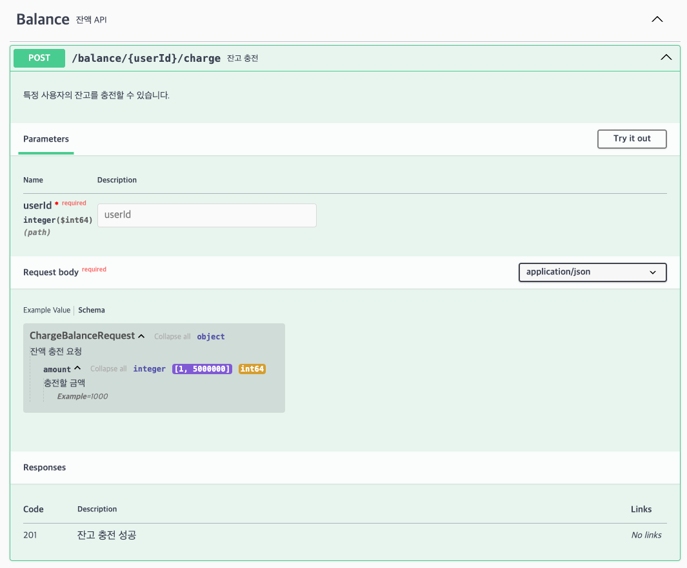
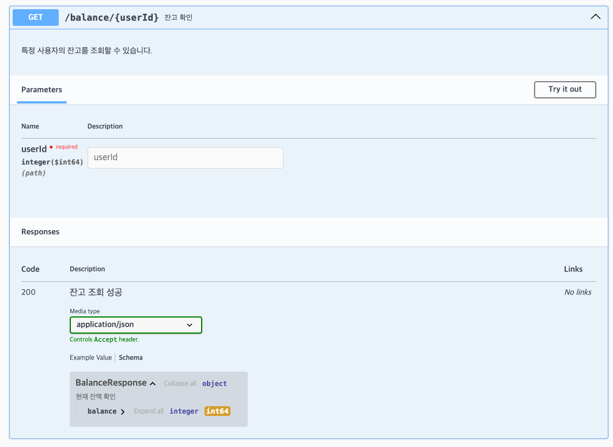
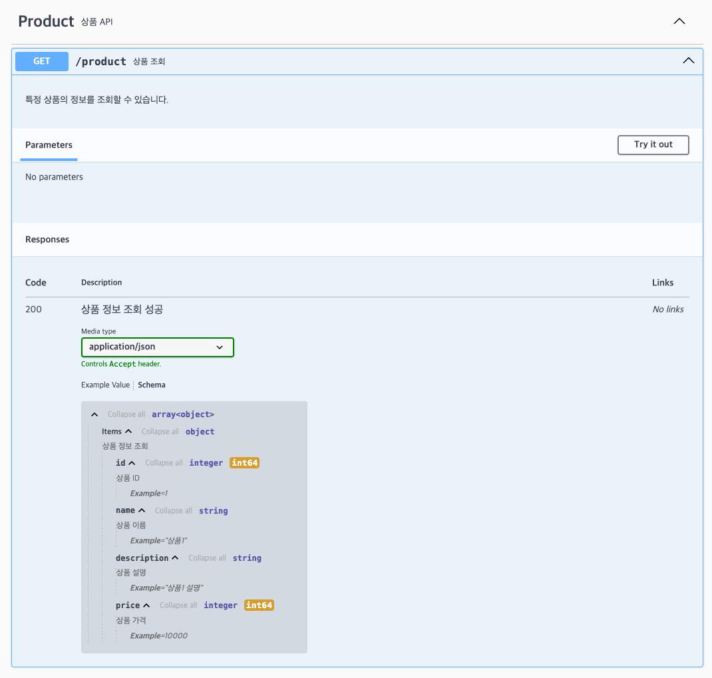
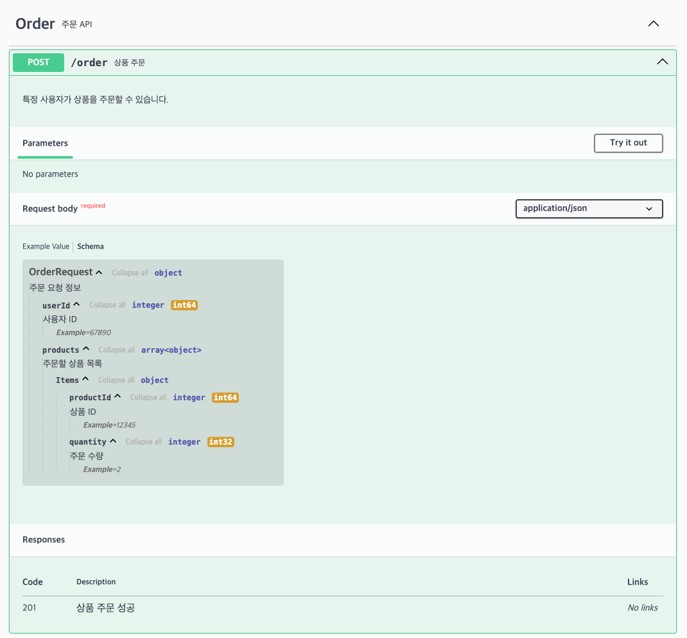
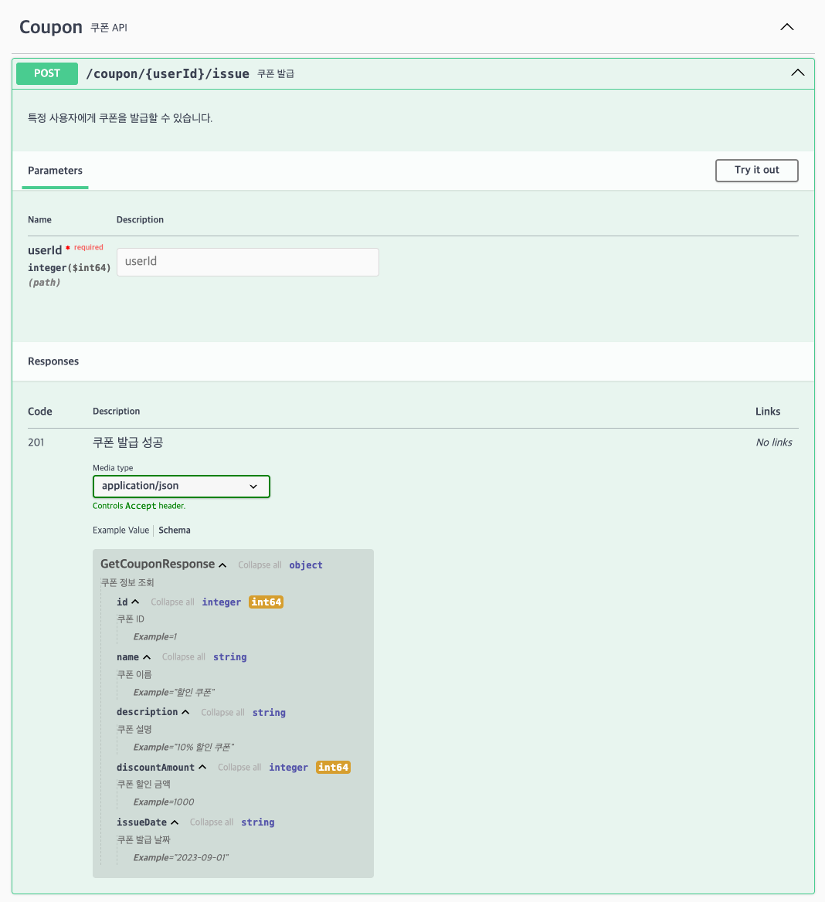
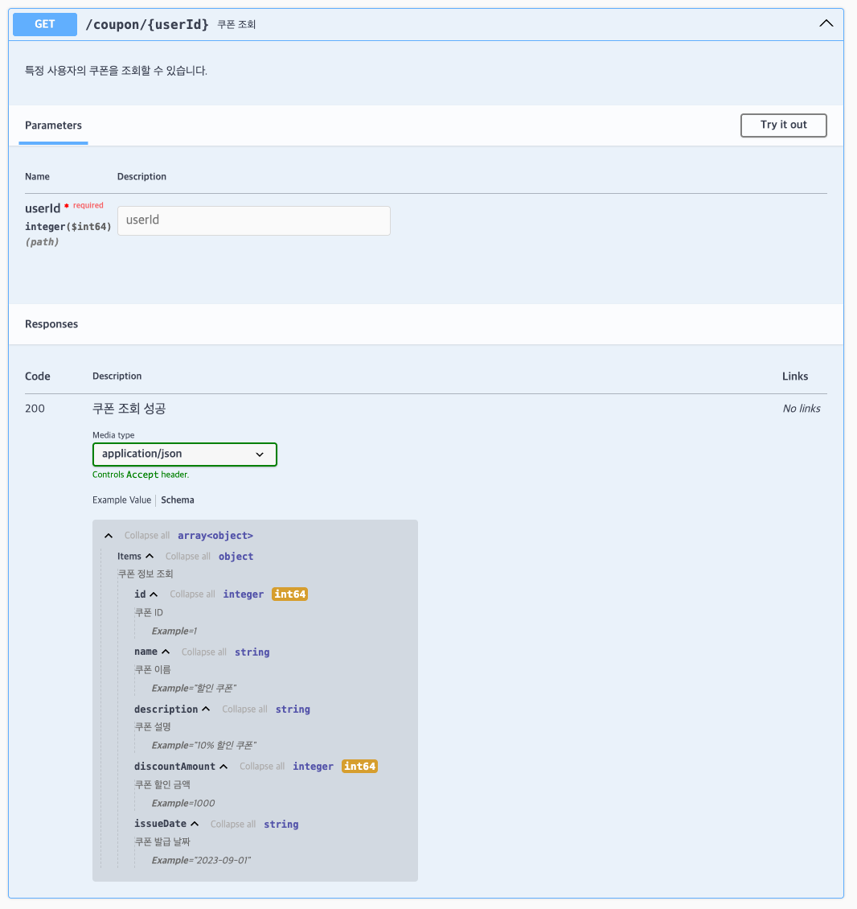
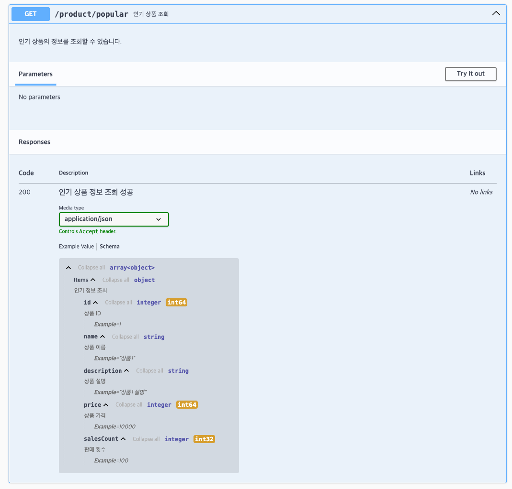

## API 명세

- 잔액 충전 : `POST /balance/{userId}/charge`

- 잔액 조회 : `GET /balance/{userId}`

- 상품 조회 : `GET /product`

- 주문/결제 : `POST /order`

- 선착순 쿠폰 발급 : `POST /coupon/{userId}/issue`

- 선착순 쿠폰 조회 : `GET /coupon/{userId}`

- 인기 판매 상품 조회 : `GET /product/popular`

